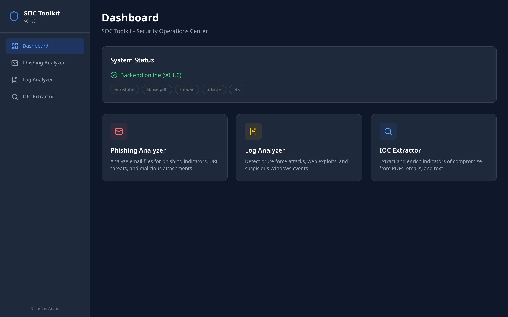
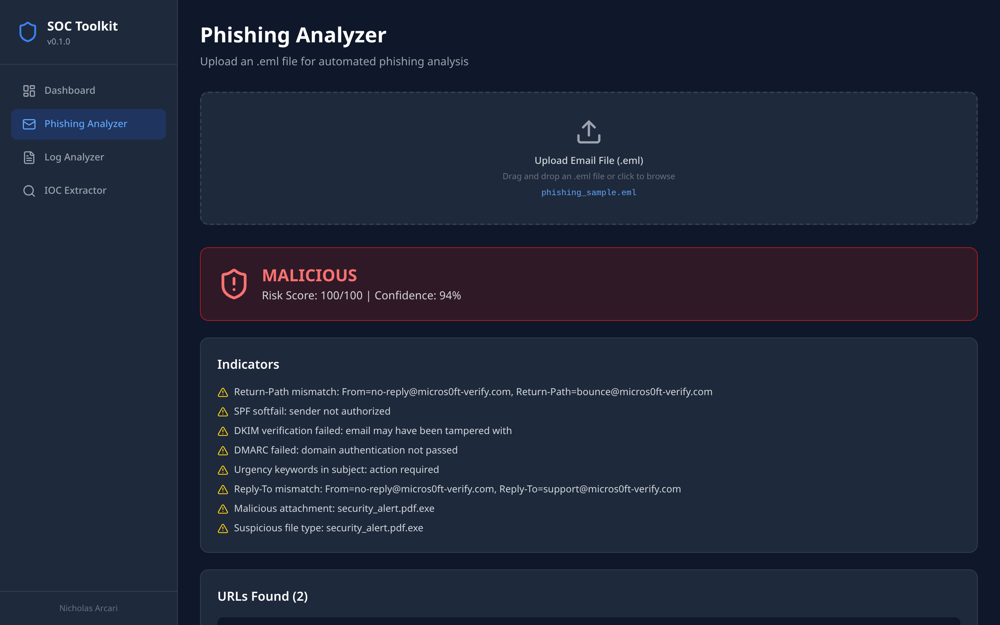
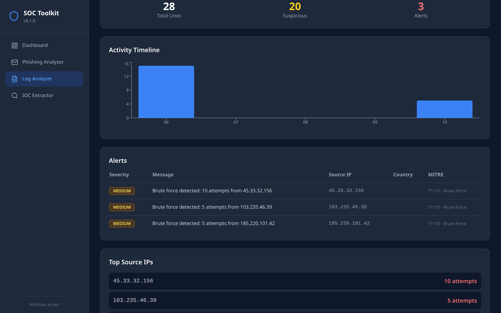
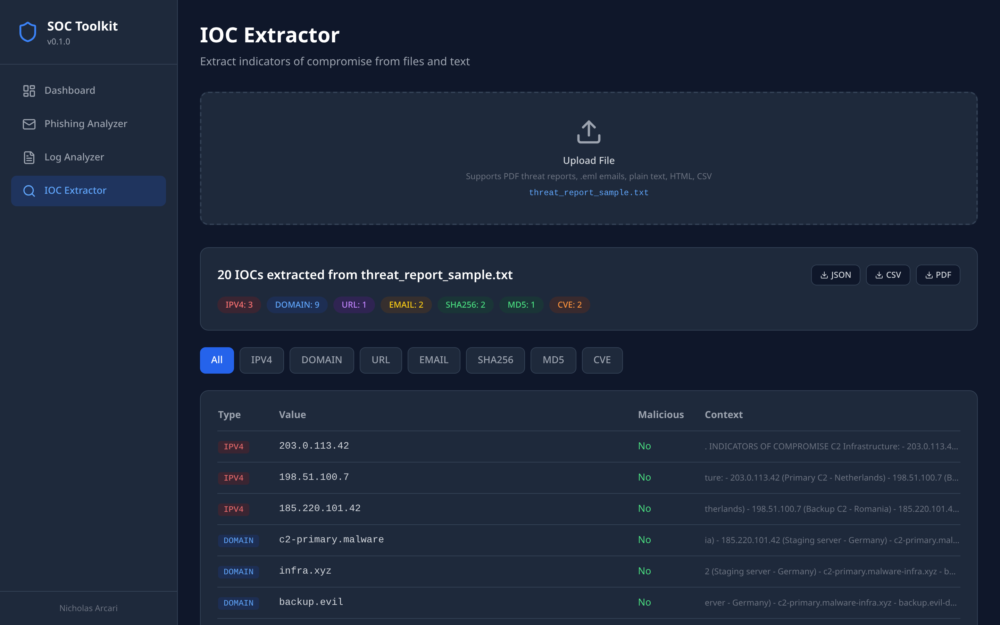
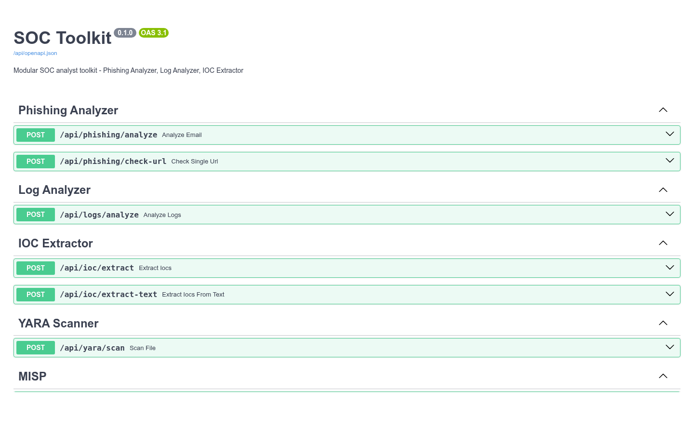

# SOC Toolkit

[](https://github.com/Nicholas-Arcari/soc-toolkit/actions/workflows/ci.yml)


Modular SOC analyst toolkit with REST API backend and React frontend. Designed for day-to-day security operations: email triage, log investigation, and threat intelligence enrichment.

> **For authorized security testing and research only.** See
> [`ETHICS.md`](ETHICS.md) for the authorization framework that governs this
> project. Versione italiana: [`docs/it/ETICA.md`](docs/it/ETICA.md).
>
> **Monorepo.** This repository ships two companion toolkits built on a shared library.
> **`soc-toolkit`** (this README) is the blue-team workflow tool. **`osint-toolkit`** is a
> separate app for attack-surface management and investigative OSINT - see
> [`packages/osint-toolkit/README.md`](packages/osint-toolkit/README.md). Shared HTTP
> clients, IOC parsing and the on-disk response cache live in
> [`packages/sec-common`](packages/sec-common/).

## Why

A SOC analyst can spend up to 30% of their shift on repetitive tasks: phishing triage, IOC extraction from threat reports, log parsing, IP reputation lookups. This toolkit automates the grunt work so analysts can focus on actual investigation.

- **`.eml` → verdict in seconds** - SPF/DKIM/DMARC + URL + attachment scan + 0-100 risk score
- **Log file → alerts with MITRE ATT&CK mapping** - SSH brute force, web exploits, Windows lateral movement
- **Threat report → structured IOC table** - IPs, domains, hashes, CVEs enriched via VirusTotal, AbuseIPDB, OTX

## Screenshots

### Dashboard


### Phishing Analyzer - verdict engine
Automated analysis of a spoofed Microsoft security alert: SPF softfail, DKIM failure, DMARC failure, double-extension attachment (`security_alert.pdf.exe`), Return-Path mismatch. Risk score 100/100, verdict `MALICIOUS`.



### Log Analyzer - MITRE ATT&CK mapping
SSH brute force detection across 28 log lines, 3 alerts generated with MITRE `T1110` mapping and Top Source IPs ranking.



### IOC Extractor - multi-format parsing
20 IOCs extracted from a threat intelligence report: 3 IPv4 · 9 domains · 1 URL · 2 emails · 2 SHA256 · 1 MD5 · 2 CVEs. Each IOC is shown with its surrounding context and exported to JSON/CSV/PDF.



### API explorer - Swagger UI
Every route is documented at `/api/docs`, with live request/response
schemas. Handy for wiring new integrations into a SIEM or playbook
runner.



> Reproducing these screenshots: boot `docker compose --profile all up`
> and run `./scripts/seed-demo.sh`. Conventions in
> [`docs/regenerating-screenshots.md`](docs/regenerating-screenshots.md).

## Modules

### Phishing Analyzer
Upload `.eml` files for automated analysis:
- **Header analysis** - SPF/DKIM/DMARC verification, sender anomaly detection, Received chain tracing
- **URL scanning** - Pattern-based detection (brand impersonation, suspicious TLDs, shorteners) + VirusTotal/URLScan.io lookup
- **Attachment scanning** - Hash computation, double extension detection, VirusTotal/MalwareBazaar lookup
- **Verdict engine** - Automated risk scoring (0-100) with confidence level and actionable recommendations

### Log Analyzer
Upload log files for threat detection:
- **SSH logs** - Brute force detection, failed/successful login correlation, attacker IP geolocation
- **Web logs** - SQL injection, path traversal, command injection, scanner/enumeration detection
- **Windows Security logs** - Event ID correlation (4625, 4697, 7045...), lateral movement detection, persistence mechanism alerts
- **Alert engine** - Severity-based alerts with AbuseIPDB enrichment and MITRE ATT&CK mapping

### IOC Extractor
Extract indicators from threat reports, emails, and raw text:
- **Supported IOC types** - IPv4, domains, URLs, email addresses, MD5/SHA1/SHA256 hashes, CVE identifiers
- **Input formats** - PDF (threat reports), .eml (emails), plain text, HTML, CSV
- **Enrichment** - Automated validation via VirusTotal, AbuseIPDB, AlienVault OTX
- **Context preservation** - Surrounding text captured for each IOC

### IOC Pivot
Drill down into a single indicator across multiple passive sources - certificate transparency, passive DNS, WHOIS history, reverse DNS, ASN, Shodan, Censys - so an IP or domain from a ticket becomes a full infrastructure picture without touching the target.

### YARA Scanner
Upload a file and match it against a curated rule set. Each hit is shown with severity, MITRE technique mapping and a reference link to the rule's origin, so an analyst can go from "this file matched X" to "here's the threat actor / malware family" in one view.

### Sigma Detection
Inspect the bundled rule library and evaluate JSON events (SSH, web, Windows) against it on demand. Designed to validate Sigma rules before deploying them into the SIEM rather than replacing it.

### MISP Enrichment
Paste threat-report text, extract IOCs, and flag which ones your MISP instance already knows. Degrades cleanly with a "MISP not configured" signal when no instance is reachable - every IOC still gets extracted, they're just not enriched.

## Architecture

```
┌──────────────────────────────────────────────────────────┐
│                       Frontend                            │
│                React + TypeScript + Vite                  │
│              Tailwind CSS + shadcn/ui                     │
└──────────────────────┬───────────────────────────────────┘
                       │ REST API
┌──────────────────────▼───────────────────────────────────┐
│                       Backend                             │
│                   FastAPI (Python)                        │
│                                                           │
│  ┌──────────┐ ┌────────┐ ┌─────────┐ ┌──────────────┐    │
│  │ Phishing │ │  Logs  │ │   IOC   │ │  IOC Pivot   │    │
│  │ Analyzer │ │Analyzer│ │Extractor│ │              │    │
│  └────┬─────┘ └───┬────┘ └────┬────┘ └──────┬───────┘    │
│       │           │           │             │             │
│  ┌────▼─────┐ ┌───▼────┐ ┌────▼────────────▼───────┐    │
│  │  YARA    │ │ Sigma  │ │    MISP Enrichment     │    │
│  │ Scanner  │ │  Rules │ │                         │    │
│  └────┬─────┘ └───┬────┘ └────────────┬───────────┘     │
│       └───────────┼───────────────────┘                  │
│                   │                                       │
│  ┌────────────────▼─────────────────────────────────┐    │
│  │  sec-common: HTTP Clients · IOC parser · Cache   │    │
│  │  VirusTotal · AbuseIPDB · Shodan · URLScan       │    │
│  │  MalwareBazaar · OTX · crt.sh · SecurityTrails   │    │
│  └──────────────────────────────────────────────────┘    │
│                   │                                       │
│  ┌────────────────▼─────────────────────────────────┐    │
│  │        SQLite Cache + Token-bucket Limiter       │    │
│  └──────────────────────────────────────────────────┘    │
└──────────────────────────────────────────────────────────┘
```

## Quick Start

### Docker (recommended)

```bash
cp .env.example .env
# Edit .env with your API keys
docker compose --profile soc up --build          # just the SOC stack
docker compose --profile all up --build          # SOC + OSINT side by side
```
- SOC frontend: http://localhost:3000  · SOC API: http://localhost:8000/api/docs
- OSINT frontend: http://localhost:3001 · OSINT API: http://localhost:8001/api/docs

### Local Development

**Backend:**
```bash
cd packages/soc-toolkit/backend
poetry install
cp ../../../.env.example ../../../.env
poetry run uvicorn api.app:app --reload
```

**Frontend:**
```bash
cd packages/soc-toolkit/frontend
npm install
npm run dev
```

### CLI

```bash
cd packages/soc-toolkit/backend
poetry run python cli.py phishing suspicious_email.eml
poetry run python cli.py logs /var/log/auth.log --log-type ssh
poetry run python cli.py ioc threat_report.pdf
```

## API Endpoints

| Method | Endpoint | Description |
|--------|----------|-------------|
| `POST` | `/api/phishing/analyze` | Analyze an email file (.eml) |
| `POST` | `/api/phishing/check-url` | Check a single URL |
| `POST` | `/api/logs/analyze` | Analyze a log file |
| `POST` | `/api/ioc/extract` | Extract IOCs from a file |
| `POST` | `/api/ioc/extract-text` | Extract IOCs from raw text |
| `POST` | `/api/osint/pivot` | Drill a single IOC across CT / pDNS / WHOIS / ASN / Shodan |
| `POST` | `/api/yara/scan` | Scan an uploaded file against the YARA rule set |
| `GET`  | `/api/sigma/rules` | List the bundled Sigma rule library |
| `POST` | `/api/sigma/evaluate` | Evaluate a list of JSON events against Sigma rules |
| `POST` | `/api/misp/enrich` | Extract IOCs from text and flag which ones MISP already knows |
| `POST` | `/api/misp/lookup` | Look up a single indicator in MISP |
| `POST` | `/api/reports/export` | Export results (JSON/CSV/PDF) |
| `GET`  | `/api/health` | Health check + configured APIs |

Full interactive docs at `/api/docs` (Swagger UI).

## Integrations

| Service | API Tier | Rate Limit | Used For |
|---------|----------|------------|----------|
| [VirusTotal](https://www.virustotal.com/) | Free | 4 req/min | URL, hash, IP, domain lookup |
| [AbuseIPDB](https://www.abuseipdb.com/) | Free | 1000/day | IP reputation and abuse reports |
| [Shodan](https://www.shodan.io/) | Free | Limited | IP reconnaissance, open ports |
| [URLScan.io](https://urlscan.io/) | Free | 50 scans/day | URL scanning and screenshots |
| [MalwareBazaar](https://bazaar.abuse.ch/) | Free | No key needed | Malware sample lookup |
| [AlienVault OTX](https://otx.alienvault.com/) | Free | Unlimited | Threat intelligence pulses |

## Export Formats

- **JSON** - Machine-readable, for SIEM import or further processing
- **CSV** - Spreadsheet-compatible, for IOC lists and alert tables
- **PDF** - Professional reports with severity badges, suitable for management

## Tech Stack

- **Backend:** Python 3.12, FastAPI, SQLAlchemy, Pydantic, WeasyPrint
- **Frontend:** React 18, TypeScript, Vite, Tailwind CSS, shadcn/ui
- **Database:** SQLite (API response caching)
- **Deployment:** Docker Compose
- **CI/CD:** GitHub Actions (Ruff linting, MyPy type checking, pytest)

## Security & observability

Both toolkits share the same opt-in hardening layer (lives in
`sec-common`, disabled by default so a clean clone runs with zero
config).

- **Per-user auth (JWT).** Set `AUTH_SECRET` to 32+ bytes of entropy
  (`openssl rand -hex 32`). First visit to the UI prompts admin
  signup; subsequent visits only allow login. Tokens default to
  60 minutes - tune with `AUTH_TOKEN_TTL_MINUTES`. Leave `AUTH_SECRET`
  empty to keep the toolkit open on trusted networks.
- **Shared-secret gate (`X-API-Key`).** Complementary to per-user
  auth. Set `API_KEY` in `.env` to require a header on every `/api/*`
  call (useful for reverse-proxy → app shared secrets).
- **Prometheus metrics.** Every backend exposes `/metrics` with
  request counters, in-flight gauge and latency histograms keyed on
  templated routes (no cardinality explosion from `/scans/{id}`).
  Drop the dashboard at
  [`docs/grafana/sec-toolkit-overview.json`](docs/grafana/sec-toolkit-overview.json)
  into a Grafana instance pointed at Prometheus to get the five-panel
  overview (RPS, error rate, in-flight, p50/p95/p99, top routes).
- **End-to-end smoke tests.** Playwright drives both UIs against the
  running compose stack; see
  [`e2e/README.md`](e2e/README.md) and the `e2e-smoke` CI job.
- **Signed releases.** Every tagged image on GHCR is cosign-signed
  (keyless, OIDC identity bound to the release workflow) and ships
  with a SLSA build-L2 provenance + SBOM attestation. Verification
  one-liners in [`SECURITY.md`](SECURITY.md).

## License

MIT License - see [LICENSE](LICENSE) for details.