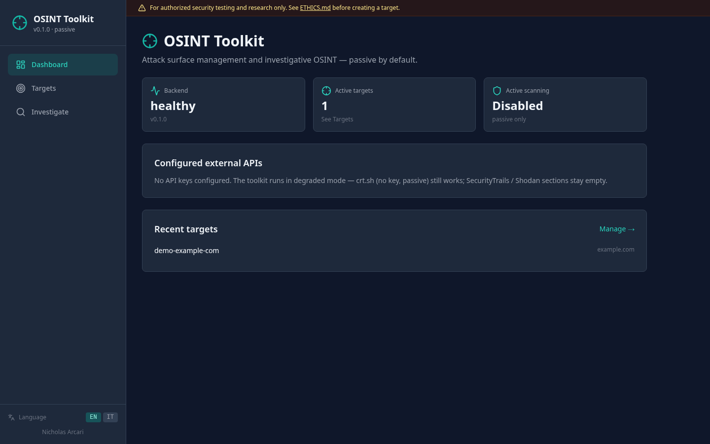
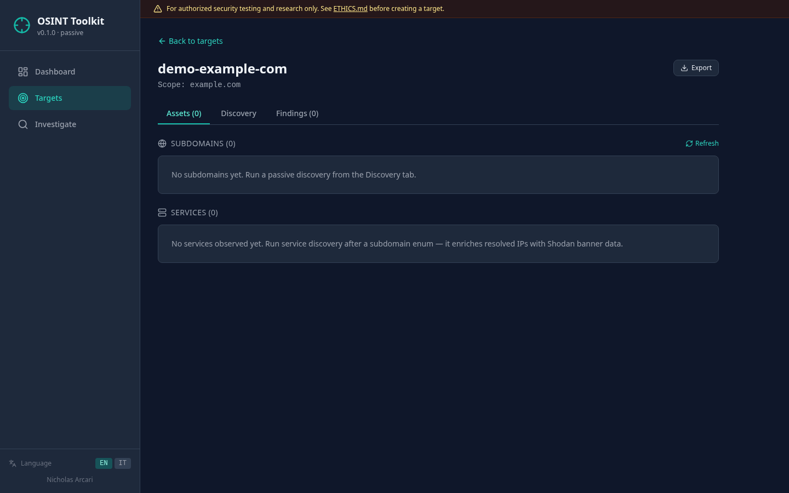
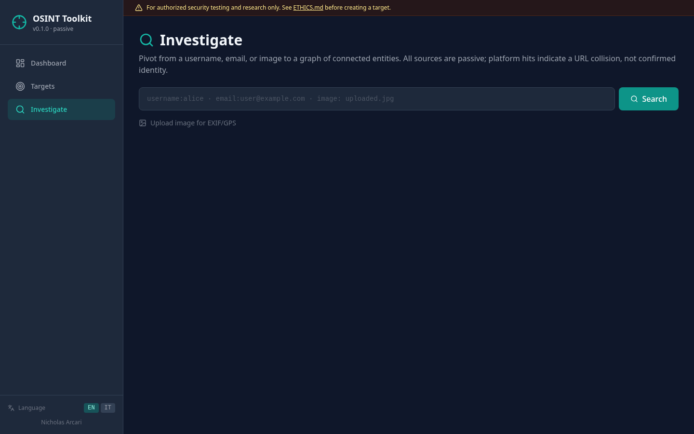

# OSINT Toolkit

[](https://github.com/Nicholas-Arcari/soc-toolkit/actions/workflows/ci.yml)


> **For authorized security testing and research only.** See
> [`ETHICS.md`](../../ETHICS.md) for the authorization requirements enforced
> by this toolkit and the legal framework that sits behind them. Versione
> italiana: [`docs/it/ETICA.md`](../../docs/it/ETICA.md).

Attack-surface management and investigative OSINT companion to
[`soc-toolkit`](../soc-toolkit/). Where `soc-toolkit` is stateless - upload,
analyze, export - the OSINT toolkit is stateful: you register an authorized
target, scan it, and the history accumulates so changes in the perimeter
become visible over time.

## Demo

```bash
cp .env.example .env
docker compose --profile all up -d --build
./scripts/seed-demo.sh
```

The seed script registers an authorized `demo-example-com` target,
runs a passive subdomain-enum pass against it, and analyses the SOC
bundled samples. Landing pages to tour once the seed completes:

- **Dashboard** - http://localhost:3001
- **Target detail / Discovery tab** - open `demo-example-com` from the
  Targets list; subdomains, services and findings land here.
- **Investigate** - http://localhost:3001/investigate; paste a username
  to see the entity graph populate.

## Screenshots

### Dashboard
Backend health, active target count, and degraded-mode hints - the
toolkit boots with zero API keys and tells you which sources stay dark
until they're configured.



### Target detail - Assets / Discovery / Findings
Every authorized target opens into a workspace. Subdomains and services
accumulate across scans; findings let an analyst triage SPF/DMARC gaps
and CVE-bearing banners without leaving the tab.



### Investigate - passive pivot
Username, email, or image → HTTP-probed hits, breach lookups and
EXIF/GPS extraction, rendered as an entity graph so pivoting from
`username` → `platform` → `breach` is one click.



> Reproducing these: boot `docker compose --profile all up`, run
> `./scripts/seed-demo.sh`, then
> `node e2e/scripts/capture-osint-screenshots.mjs`. Conventions live in
> [`docs/regenerating-screenshots.md`](../../docs/regenerating-screenshots.md).

## What it does today

- **Target registry** - A `Target` is a named authorized perimeter with a
  `scope_domains` list. Every discovery is filtered through the scope before
  it is persisted; neighbor domains that passive sources leak cannot creep
  in. The `authorized_to_scan` flag is required at creation and is not
  editable via PATCH - revoking authorization means deleting the target.
- **Passive subdomain enumeration** - Merges results from crt.sh
  (Certificate Transparency, no API key) and SecurityTrails (API key
  optional; the call is skipped cleanly when the key is missing). Wildcard
  entries are dropped. Re-scans update `last_seen` on existing rows, so the
  UI can show "discovered N days ago, still present" vs "appeared once".
- **DNS mapping** - Resolves A / AAAA / MX / NS / TXT per scope root and
  parses SPF / DMARC. Missing SPF, permissive `+all`, missing DMARC or
  `p=none`, and NS counts below RFC 2182's minimum all surface as findings
  the analyst can triage in the Findings tab.
- **Service discovery** - Shodan IP lookup on every resolved subdomain
  with per-IP deduplication so the free-tier rate limit survives repeat
  scans. Open ports land in `Service`; CVEs surface as both service metadata
  and high-severity findings. Degrades cleanly without `SHODAN_API_KEY`.
- **Scan history** - Every scan persists a row with status, summary, and
  error message. A scan that fails still leaves a durable trail instead of
  disappearing.
- **Passive-by-default** - Active scanning (Amass/Subfinder) is gated by the
  `OSINT_ENABLE_ACTIVE_SCANNING` flag, which defaults to false. A public
  install is safe to stand up without further lockdown.
- **Investigate view** - A second persona uses the toolkit without targets:
  paste a username, email, or upload an image and the backend fans out to
  passive probes (Sherlock-style HTTP status checks, HIBP breach lookup,
  EXIF/GPS extraction via Pillow). Every response carries an `EntityGraph`
  that the frontend renders with `react-cytoscapejs`, so pivoting visually
  between username → platform → breach works without extra round-trips.
  HIBP degrades cleanly when no API key is configured.

## Quick start

From the repository root:

```bash
cp .env.example .env                              # shared with soc-toolkit
docker compose --profile osint up --build
```

- Frontend: http://localhost:3001
- API docs: http://localhost:8001/api/docs

### Local development

```bash
cd packages/osint-toolkit/backend
poetry install
poetry run alembic upgrade head
poetry run uvicorn api.app:app --reload --port 8001
```

```bash
cd packages/osint-toolkit/frontend
npm install
npm run dev
```

## API

| Method | Endpoint | Description |
|--------|----------|-------------|
| `POST` | `/api/targets` | Create an authorized target (requires `authorized_to_scan=true`) |
| `GET`  | `/api/targets` | List targets (filterable by `active`) |
| `GET`  | `/api/targets/{id}` | Fetch a single target |
| `PATCH`| `/api/targets/{id}` | Update target metadata (authorization cannot be revoked here) |
| `DELETE` | `/api/targets/{id}` | Delete target + cascading scans/subdomains/findings |
| `POST` | `/api/scans/targets/{id}/subdomain-enum` | Run passive subdomain enum |
| `POST` | `/api/scans/targets/{id}/dns-mapping` | Resolve A / MX / NS / TXT and flag SPF/DMARC issues |
| `POST` | `/api/scans/targets/{id}/service-discovery` | Shodan per resolved IP; CVEs surface as findings |
| `GET`  | `/api/scans/targets/{id}/subdomains` | List discovered subdomains (last_seen desc) |
| `GET`  | `/api/scans/targets/{id}/services` | List open services observed on the target |
| `GET`  | `/api/scans/targets/{id}/findings` | List analyst-visible issues against the target |
| `POST` | `/api/investigate/username` | Sherlock-style probe, returns hits + entity graph |
| `POST` | `/api/investigate/breaches` | HIBP account/domain lookup, degrades without key |
| `POST` | `/api/investigate/image` | Multipart upload; extracts EXIF + GPS |
| `GET`  | `/api/health` | Configured APIs + active-scanning flag |

## Configuration

OSINT toolkit reads the shared `.env` at repository root. Namespaced vars:

| Variable | Default | Purpose |
|----------|---------|---------|
| `OSINT_DATABASE_URL` | `sqlite+aiosqlite:///./osint_toolkit.db` | Persistent state (targets, scans, findings) |
| `OSINT_ENABLE_ACTIVE_SCANNING` | `false` | Gate for active tooling (Amass/Subfinder) |
| `SECURITYTRAILS_API_KEY` | (optional) | Shared with soc-toolkit; pDNS enrichment degrades cleanly if missing |
| `HIBP_API_KEY` | (optional) | Required for `/api/investigate/breaches`; degraded mode when missing |

## Roadmap

- **Active scanning polish** - Amass / Subfinder invocation is wired behind
  `OSINT_ENABLE_ACTIVE_SCANNING` today; the next step is a first-class
  scan kind with progress reporting and a confirmation modal in the UI.
- **Reverse image search** - Deferred until a free-tier provider reappears;
  Tineye and Google reverse-image no longer have workable public APIs.
- **Scheduled re-scans** - APScheduler wiring so a registered target gets
  re-enumerated on a cadence, with diffing against the previous run.

## License

MIT - see [LICENSE](../../LICENSE). Read [ETHICS.md](ETHICS.md) before you
point this at anything.
